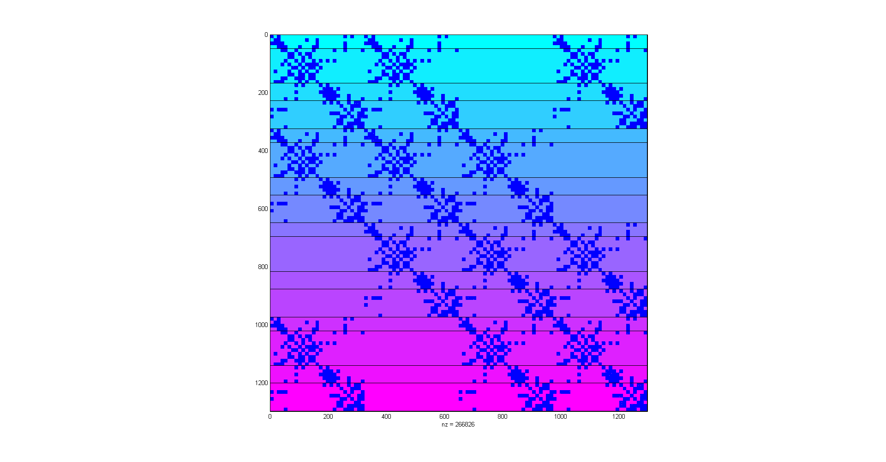
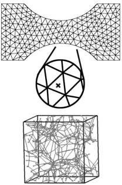

### About Me

I am a computer science post-doctoral researcher at Rensselaer Polytechnic Institute (RPI) in Troy, NY, where I work for the Scientific Computation Research Center [(SCOREC)](https://www.scorec.rpi.edu/). I develop software for HPC machines and applications. My thesis work has been concerning the development of tools and libraries for the efficient implementation and execution of multi-scale numerical simulations on HPC architectures.

I'm also an avid hiker and a 46r (#10768) and I'm working on becoming a winter 46r as well. I'm also a leader in the RPI Graduate Outdoor Recreation Program (GORP) and design and lead both events for the general graduate student body and training events for GORP leaders-in-training. I'm CPR and WFA certified and hope to obtain my WFR certification soon.

### Research

My thesis and primary work has been the Adaptive Multi-scale Simulation Infrastructure (AMSI), a set of libraries to assist in the development and execution of numerically multi-scale simulations, specifically on HPC machines but targeting in particular the IBM BlueGene/Q architecture. Most performance runs involving AMSI-supported code have been conducted on the AMOS BlueGene/Q machine managed by the [CCI](http://cci.rpi.edu/).

Additionally I have conducted work to develop numerical HPC simulations and tools including a multi-scale soft biological tissue simulation using the AMSI libraries, the Simmetrix backend for the SCOREC/core tools, and am currently assisting in the development of several fusion codebases.

### Libraries and Projects (listed chronologically)

***m3dc1*** is a fusion code developed by the Princeton Particle Physics Laboratory (PPPL). I am currently working on improving the interaction and usage of the code with the meshing and tensor field libraries [SCOREC/core](https://github.com/SCOREC/core) and the linear algebraic systems library we're currently using (PETSc). Primarily I am focused on improving the efficiency of the finite element assembly procedure, w.r.t. both algorithmic and parallel data locality.

[***msi***](https://github.com/SCOREC/msi) is the Mesh Solver Interface. It is intended as a minimal CAPI allowing access to the features in SCOREC/core and their interactions with a linear algebraic system. It is being used to support the implementation of m3dc1 and another fusion code based on xgc. It is best to think of it as a wrapper layer between various backends, facilitating interactions which require operations from the discretized domain and tensor fields, the linear system, and the numerical kernels supplied by application developers.

[***LAS***](https://github.com/tobinw/las) is a zero-overhead API for operating on linear algebraic systems operating both in distributed-memory parallel and shared-memory parallel machines. LAS takes advantage of the C++ Curiously Recurring Template Pattern (CRTP) and aggressive inlining to optimize the API function calls away at compile-time. Each linear algebraic system provided to the library at configuration time additionally has a CAPI auto-generated at configuration and compile time which has a single function call overhead to allow using the API from strict C or FORTRAN code since naturally the backend functions cannot be inlined into those languages at compile time.

  
A small PETSc matrix for the M3DC1 simulation using LAS to manage the linear system.

***AMSI*** (contains proprietary API calls from an industry partner so source code is currently private) is a set of libraries used to support the implementation and execution of multi-scale numerical simulations. While many multi-scale systems require adherence to a strict API or set of data structures to which a user must adapt their code, AMSI is intended for use in combining existing well-established single-scale simulation codes. Refactoring and reimplementing a codebase to target a particular multi-scale framework is undesirable, so AMSI requires intervention in exising code only during initialization and at locations where multi-scale values influencing the simulation is required.

Currently AMSI provides the most support for hierarchical multi-scale simulations, where the scales are seperated by many orders of magnitude (typically 6 or more), so inter-domain information required to establish coupling relationships is minimal. Using AMSI in a concurrent multi-scale simulation is certainly possible, but would require the user to implement methods for the interacting scales to establish inter-domain relationships for the scale-coupling. Extending AMSI with generic functionality supporting concurrent multi-scale simulations is a target for future work.

***biotissue*** (also contains API calls from an industry partner) is a multi-scale soft-tissue simulation using AMSI to couple together two scales: an engineering scale (cm and mm scale) and micro-scale (micrometer to nanometer). The engineering scale uses a finite element analysis code based on the Cauchy momentum balance equations for a body in static equilibrium, at every numerical integration point a micro-scale representative volume element (RVE) analysis takes place. Each RVE is a dimensionless bi-unit cube containing a fiber network modeled by truss elements. The macro-scale establishes boundary conditions at the micro-scale RVE corners, which displace the boundary nodes of the fiber network of truss elements. Producing a solution for the micro-scale system gives rise to a set of forces on the boundaries of the RVE which are dimensionalized and sent to the macro-scale for use as stress and stress-derivative terms in the macro-scale governing equations.

  
The two biotissue scales: an engineering scale unstructured mesh coupled to dimensionless RVE cube containing a fiber network.

[***byte_stream***](https://github.com/tobinw/byte_stream) is a header-only library using C++11 variadic templates to assist in the serialization and deserialization of data structures. It can handle any Plain-old-datatype trivially, but for datatypes requiring a deep copy it can still provide utility. Mostly it was used to package up small objects to be sent over MPI to avoid defining a custom MPI_Datatype since defining custom MPI_Datatypes is essentially code duplication since you have to define your structure in two places: once in actual code and once to the MPI system.

[***tensor***](https://github.com/tobinw/tensor) is a basic implementation of a tensor interface using C++11 variadic templates. It was an attempt at getting a general tensor datatype with low-overhead data access operators to be specialized and used in other libraries needing vectors, matrices, and possibly higher-order tensors, but was discontinued after some initial speculative implementation of a basic dense tensor type (densor).

### Scholarly Contributions

#### Papers / Articles

Chan, Victor W. L. and *Tobin, W.R.* et al, "Image-Based Multi-scale Mechanical Analysis of Strain Amplification in Neurons Embedded in Collagen Gel", Computer Methods in Biomechanics and Biomedical Engineering, in submission.

#### Presentations

*Tobin, W.R.* and Chan, V.W.L. and Shephard, M.S., "Dynamic Load Balancing for Multiscale Simulations", CSE Seminar Series, May 2015, Rensselear Polytechnic Institute.

*Tobin, W.R.* and Chan, V.W.L. and Shephard, M.S., "Load Balancing Multiscale Simulations", SIAM Conference for Computational Science and Engineering 2015, Minisymposium on Partitioning for Multiple Constraints and Objectives.

*Tobin, W.R.* and Fovargue, D. and Shephard, M.S., "Parallel Infrastructure for Multiscale Simulation", SIAM Conference for Parallel Processing 2014, Minisymposium on Applications and Impact of FASTMATH II

### Awards

Graduate Research Fellowship, Sandia National Labs, 2012-2015

SIAM Travel Award - SIAM Conference for Computational Science and Engineering 2015
